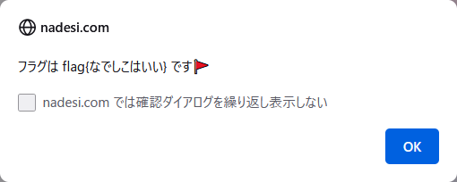

# 🐈 NakoNako

## 問題文
日本語でプログラミングができるようです！！  
プログラムを改造してフラグを見つけることができますか？？  
フラグは`flag{文字列}`の形式です。  
[flag.nako](files/flag.nako)  

## 難易度
**8割解ける**  

## 作問にあたって
私が初めに触ったプログラミング言語`なでしこ`を問題にしてみました。  
懐かしさと書き辛さを感じるようになって悲しい気分です。  
実は`なでしこ`は中学生の教科書にも載っています。  

## 解法
配布されるflag.nakoを見ると日本語で以下のように書かれている。  
```
ふらぐは空。
げんごは『{なでしこ v3}』。
うたは「いろはにほへと」。

●(文字列1と文字列2の)文字列結合とは
　　それは「{文字列1}{文字列2}」。
💧

るーぷで0から4まで繰り返す。
　　ふらぐとげんご[「{るーぷ}」]の文字列結合。
　　それをふらぐに代入。。。

ふらぐとうた[2]の文字列結合。
それとうた[0]の文字列結合とうた[0]の文字列結合。
それとげんご[8]の文字列結合。
それをふらぐに代入。

# フラグ判定
「パスワードを入力してください」と尋ねる。
ぱすわーどはそれ。
もし、それがふらぐならば、
　　「フラグは flag{ふらぐ} です🚩」と言う。
違えば、
　　「パスワードが違います😭」と言う。
💧
```
`なでしこ`というプログラミング言語のようだ。  
[なでしこ3簡易エディタ](https://nadesi.com/doc3/index.php?%E3%81%AA%E3%81%A7%E3%81%97%E3%81%933%E7%B0%A1%E6%98%93%E3%82%A8%E3%83%87%E3%82%A3%E3%82%BF)で実行できる。  
`flag{ふらぐ}`は変数の埋め込みが行われているのでフラグではないようだ。  
コードを読んでパスワードを当てるのは面倒なので、フラグ判定部分を以下のように逆に書いてみる。  
```
~~~
# フラグ判定
「パスワードを入力してください」と尋ねる。
ぱすわーどはそれ。
もし、それがふらぐならば、
　　「パスワードが違います😭」と言う。
違えば、
　　「フラグは flag{ふらぐ} です🚩」と言う。
💧
```
  
実行し、パスワードを間違えるとflagが得られた。  

## flag{なでしこはいい}