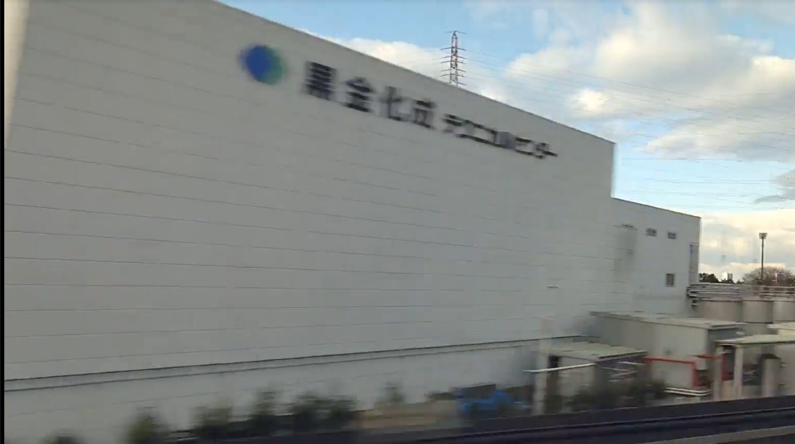
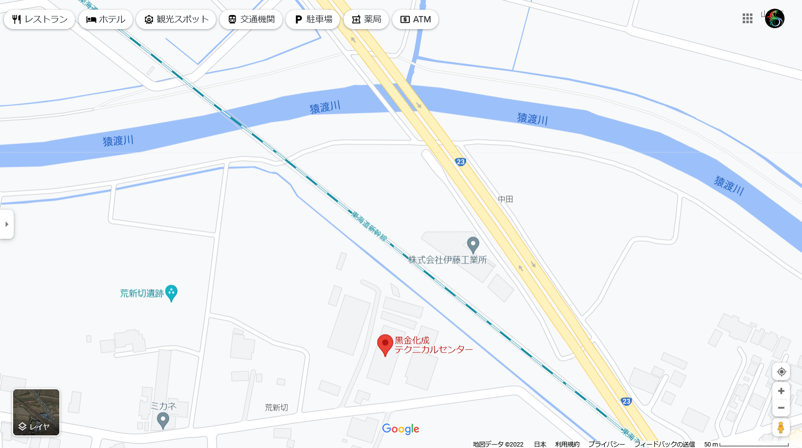

# 🚅 Civilization

## 問題文
一瞬で渡れてしまう川も彼らは苦労したらしい。  
彼らより賢くなれただろうか？  
動画で渡った川の名前を教えてください。  
フラグは `XX川` の形式です。  
[byuuuuuuun.mp4](files/byuuuuuuun.mp4)  

## 難易度
**8割解ける**  

## 作問にあたって
数合わせOSINT問です。  
何も学べるところは無く、申し訳ないです。  

## 解法
新幹線からの景色が見えている。  
一瞬だけ映る川の名前を答えればよいが、見た目でわかるわけもない。  
風景をよく見ると、何かの略だろうかKTCと書かれた建物を直前に通過する。  
動画スピードをゆっくりにするとKTC以外の建物の文字が読み取れる。  
  
「黒金　テクニカルセンター」が読み取れるので、Google検索する。  
`黒金化成 テクニカルセンター`がヒットするので、マップを見てみる。  
  
略称がKTCであり、東海道新幹線も横に通っているので間違いなさそうだ。  
横を流れる`猿渡川`がflagであった。  

## 猿渡川